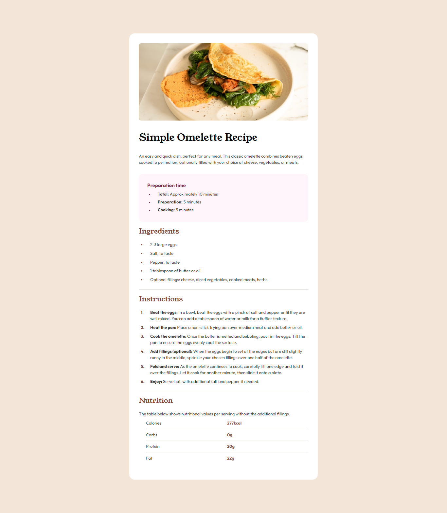

# Frontend Mentor - Recipe page solution

This is a solution to the [Recipe page challenge on Frontend Mentor](https://www.frontendmentor.io/challenges/recipe-page-KiTsR8QQKm). Frontend Mentor challenges help you improve your coding skills by building realistic projects.

## Table of contents

- [Overview](#overview)
  - [The challenge](#the-challenge)
  - [Screenshot](#screenshot)
  - [Links](#links)
- [My process](#my-process)
  - [Built with](#built-with)
  - [What I learned](#what-i-learned)
  - [Continued development](#continued-development)
  - [Useful resources](#useful-resources)
- [Author](#author)
- [Acknowledgments](#acknowledgments)

## Overview

### The challenge

Users should be able to:

- View the optimal layout for the page depending on their device's screen size

### Screenshot



### Links

- Solution URL: [Github](https://github.com/manuelcardoso5005/recipe-page-main)
- Live Site URL: [Vercel](https://recipe-page-main-ecru.vercel.app/)

## My process

### Built with

- Semantic HTML5 markup
- CSS custom properties
- Flexbox
- CSS Grid
- Mobile-first workflow

### What I learned

Working on this recipe page project was a valuable experience. Here are some of the key lessons I learned:

- **Semantic HTML Structure**: Building the page helped me understand the importance of using semantic HTML elements such as `<main>`, `<section>`, `<figure>`, and `<article>` to enhance accessibility and code organization.

```html
<main>
  <figure>
    
  </figure>
</main>
```

- CSS Custom Properties: Using CSS variables made my code cleaner and easier to maintain. It also simplified theming and allowed for quick adjustments to colors and styles.

```css
:root {
  --white: hsl(0, 0%, 100%);
  --stone-100: hsl(30, 54%, 90%);
  --stone-900: hsl(24, 5%, 18%);
  --brown-800: hsl(14, 45%, 36%);
}
```

- Flexbox and CSS Grid: I reinforced my knowledge of Flexbox and CSS Grid to create responsive and well-structured layouts, ensuring the page works well on different screen sizes.

```css
#container {
  display: flex;
  align-items: center;
  justify-content: center;
}

.group {
  display: grid;
  grid-template-columns: 1fr;
  gap: 1em;
}
```

- Mobile-first Workflow: I adopted a mobile-first development approach, which helped me create a user interface optimized for mobile devices and that adapts well to larger screens.

```css
@media screen and (max-width: 375px) {
  .recipe-text {
    padding: 2em;
  }
}
```

- Integration with Google Fonts: I learned how to integrate and use Google Fonts, enhancing the typography and overall aesthetics of the page.

```css
@import url('https://fonts.googleapis.com/css2?family=Outfit:wght@100..900&family=Roboto:wght@300;400;500;700;900&family=Young+Serif&display=swap');
```

### Continued development

In future projects, I want to focus on the following areas to continue improving my skills:

- Advanced CSS Techniques: I plan to deepen my understanding of advanced CSS techniques such as CSS Grid and Flexbox for creating more complex and responsive layouts. Additionally, I want to explore CSS animations and transitions to enhance user interactions.

- JavaScript and Frameworks: I aim to improve my proficiency in JavaScript and start incorporating modern frameworks like React.js into my projects. This will help me build more dynamic and interactive web applications.

- Accessibility: Ensuring that my websites are accessible to all users is important to me. I will continue to learn about web accessibility standards and best practices to make my projects more inclusive.

- Performance Optimization: I want to learn more about optimizing web performance, including techniques for reducing load times and improving the overall speed of my websites. This includes understanding and implementing lazy loading, minification, and other optimization strategies.

- Testing and Debugging: I plan to focus on writing better tests and using debugging tools more effectively. This will help me identify and fix issues more efficiently, leading to more robust and reliable code.

- Design Principles: I want to enhance my understanding of design principles such as color theory, typography, and layout. This will enable me to create visually appealing and user-friendly interfaces.

By concentrating on these areas, I hope to continue growing as a web developer and take on more challenging projects in the future.

### Useful resources

- [MDN Web Docs - CSS Grid Layout](https://developer.mozilla.org/en-US/docs/Web/CSS/CSS_Grid_Layout) - This resource helped me understand the fundamentals of CSS Grid layout and how to apply it effectively to create responsive designs.

- [Google Fonts](https://fonts.google.com/) - This site was essential for selecting and integrating Google Fonts into my project, enhancing the typography and overall aesthetic of the page.

- [Frontend Mentor](https://www.frontendmentor.io/community) - Community Solutions - I found inspiration and tips from other developers’ solutions on Frontend Mentor, which helped me overcome specific challenges and improve my implementation.

- [A11Y Project](https://a11yproject.com/) - This resource provided great insights into web accessibility, helping me ensure that my project meets accessibility standards and is usable by everyone.

## Author

- Frontend Mentor - [@manuelcardoso5005](https://www.frontendmentor.io/profile/manuelcardoso5005)
- Linkedin - [@manuelcardoso5005](https://www.linkedin.com/in/manuelcardoso5005/)

## Acknowledgments

I would like to thank the Frontend Mentor community for their support and feedback. Their input was invaluable in helping me improve my project. Special thanks to the creators of the resources I used for this project.